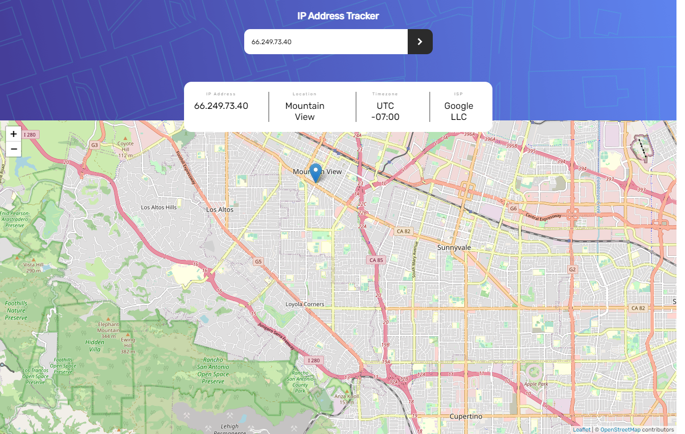
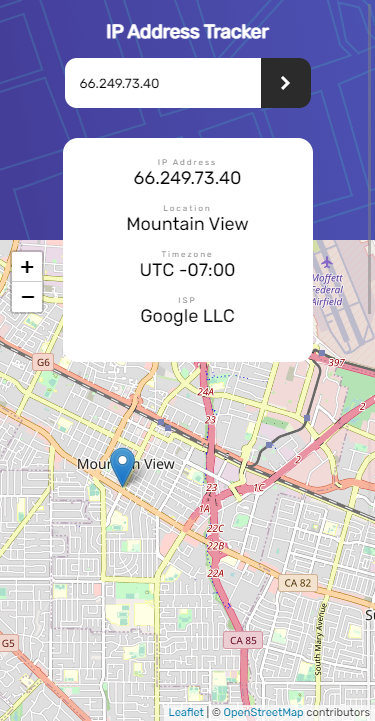

# Frontend Mentor - IP Address tracker solution

## Overview


### Screenshot






### Links

- Solution URL: [Solution](https://www.frontendmentor.io/solutions/vuejs-sLra6rJlm)
- Live Site URL: [Live](https://ip-address-tracker-vue.netlify.app/)


### Built with

- Semantic HTML5 markup
- CSS custom properties
- Flexbox
- Mobile-first workflow
- Progressive Web Application
- [Vue](https://vuejs.org/) - JS Framework
- Leaflet.JS

## Author

- Author - [Mohamed Hesham]
- Frontend Mentor - [@mohamedhesham221](https://www.frontendmentor.io/profile/yourusername)
- Linkedin - [Mohamed Hesham](https://www.linkedin.com/in/mohamed-hesham-b7611618a/)

## Project setup
```
npm install
```

### Compiles and hot-reloads for development
```
npm run serve
```
